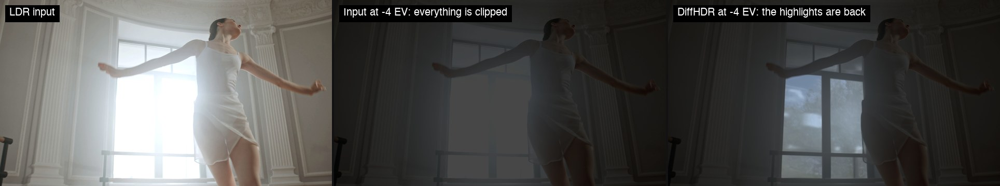
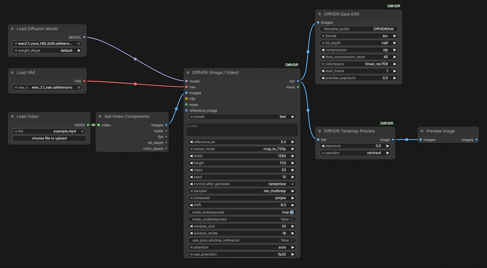
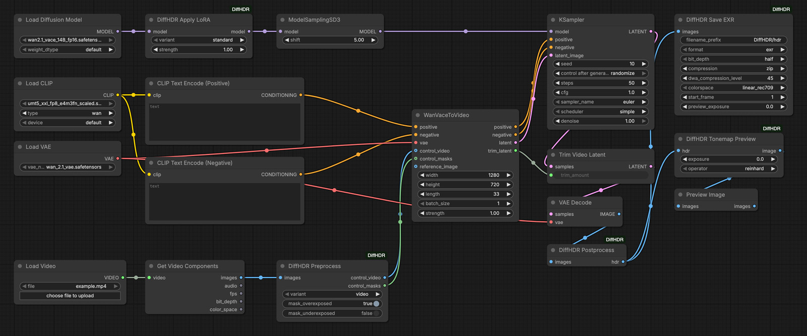
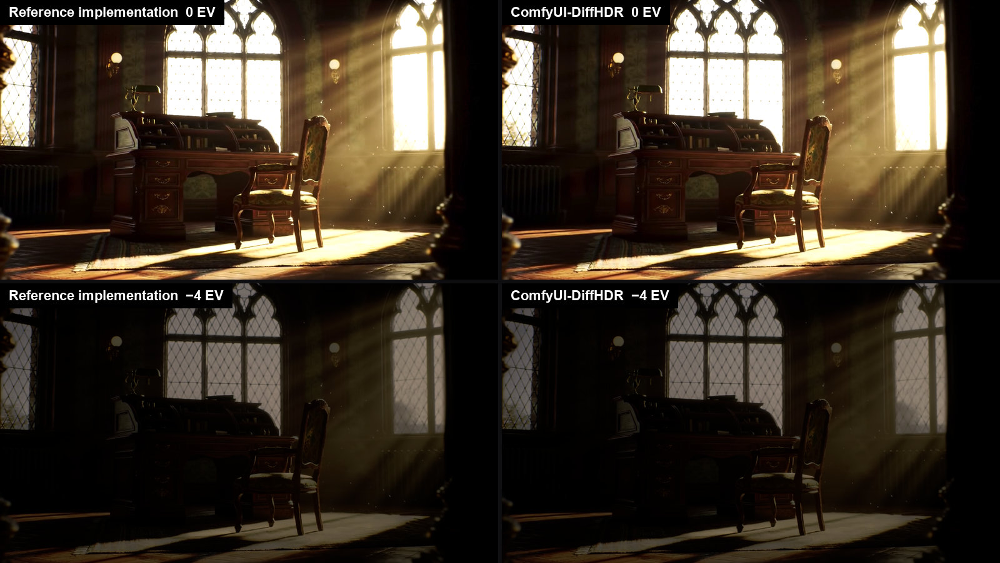
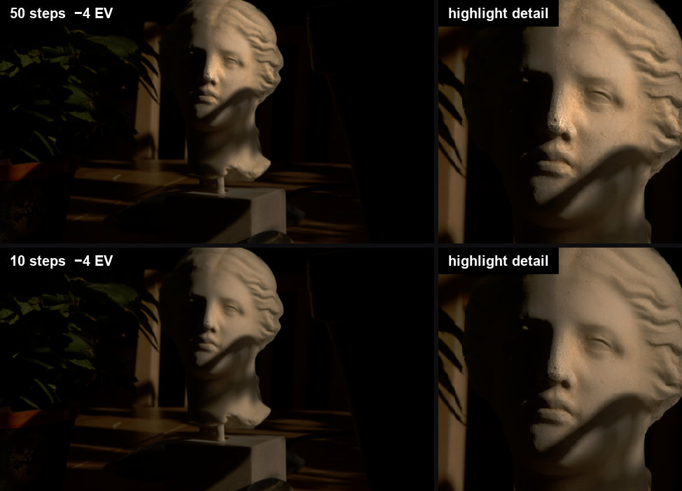
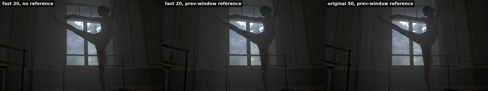
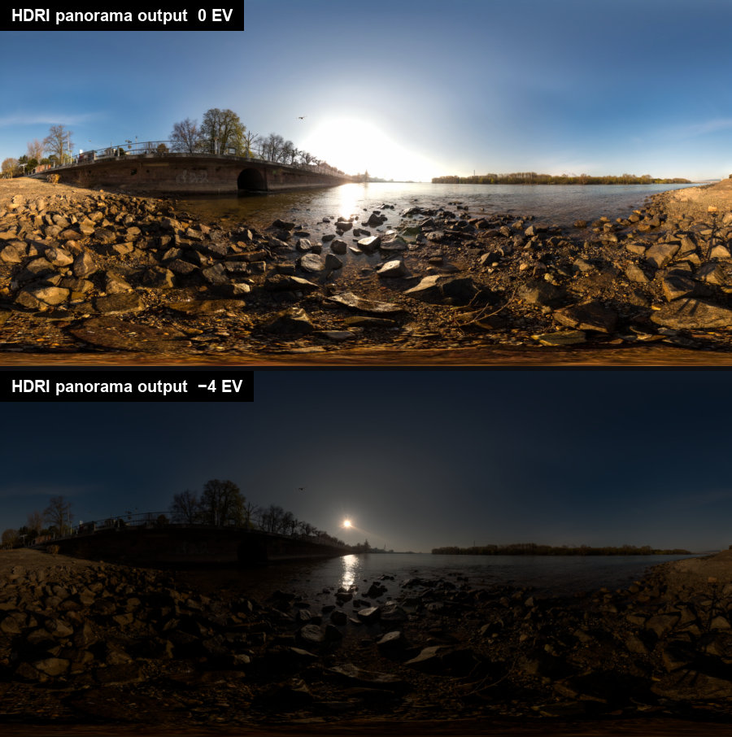

# ComfyUI-DiffHDR

Turn clipped 8-bit footage into linear, scene-referred HDR inside ComfyUI. This is a from-scratch
port of [DiffHDR](https://github.com/Eyeline-Labs/DiffHDR) (Eyeline Labs) onto ComfyUI's native
Wan2.1-VACE-14B objects — no VACE fork, no bundled inference engine.



*The first frame of the demo dance sequence. Left: the clipped LDR input. Middle: the same input
pulled down four stops — the window is a flat white shape, there is nothing to recover. Right: the
DiffHDR reconstruction at the same −4 EV (the node's defaults: `fast` preset, 20 steps), with the sky
and the trees outside the window back.*

## What it is

DiffHDR treats LDR-to-HDR conversion as a generative radiance-inpainting problem inside the latent
space of a video diffusion model (Wan2.1-VACE-14B). It works in a log-gamma color space and uses
the video model's spatio-temporal priors to synthesize plausible detail in over- and under-exposed
regions while recovering continuous radiance in the correctly-exposed ones. This pack exposes that
as seven native `DiffHDR*` nodes that plug into stock `UNETLoader` / `VAELoader` / `CLIPLoader` /
`WanVaceToVideo` / `KSampler` objects, in three modes:

- **Image** — a single clipped LDR frame in, one linear HDR frame out.
- **Video** — an LDR frame sequence in; long clips run as overlapping, blended sliding windows.
- **HDRI (panorama)** — a clipped equirectangular LDR panorama in, a full HDR environment map out,
  using a separate LoRA trained for panoramas.

## Installation

1. Clone this repository into `ComfyUI/custom_nodes/ComfyUI-DiffHDR`:
   `git clone https://github.com/cs-agentic/ComfyUI-DiffHDR.git ComfyUI/custom_nodes/ComfyUI-DiffHDR`
2. `pip install -r requirements.txt` inside your ComfyUI Python environment (adds `OpenEXR` and
   `huggingface_hub`; `torch` and `safetensors` are assumed to already be provided by ComfyUI).
3. Download the Wan2.1-VACE-14B model and the Wan 2.1 VAE into the usual ComfyUI model folders.
4. Restart ComfyUI. The nodes register under the **DiffHDR** category.

| Model | File | Source | Folder |
|---|---|---|---|
| Wan2.1 VACE 14B | `wan2.1_vace_14B_fp16.safetensors` | [`Comfy-Org/Wan_2.1_ComfyUI_repackaged`](https://huggingface.co/Comfy-Org/Wan_2.1_ComfyUI_repackaged/tree/main/split_files/diffusion_models) (`split_files/diffusion_models/`) | `models/diffusion_models` |
| Wan2.1 VACE 14B GGUF (low memory / Apple Silicon) | e.g. `Wan2.1_14B_VACE-Q4_K_M.gguf`, `Q5_K_M`, `Q8_0` | [`QuantStack/Wan2.1_14B_VACE-GGUF`](https://huggingface.co/QuantStack/Wan2.1_14B_VACE-GGUF) — requires the [ComfyUI-GGUF](https://github.com/city96/ComfyUI-GGUF) custom node (`UnetLoaderGGUF` in place of `UNETLoader`) | `models/diffusion_models` |
| Wan 2.1 VAE | `wan_2.1_vae.safetensors` | same Comfy-Org repo ([`split_files/vae/`](https://huggingface.co/Comfy-Org/Wan_2.1_ComfyUI_repackaged/tree/main/split_files/vae)) | `models/vae` |
| umT5-xxl (**optional** — only for custom prompts) | `umt5_xxl_fp8_e4m3fn_scaled.safetensors` | same Comfy-Org repo ([`split_files/text_encoders/`](https://huggingface.co/Comfy-Org/Wan_2.1_ComfyUI_repackaged/tree/main/split_files/text_encoders)) | `models/text_encoders` |
| DiffHDR LoRAs | `DiffHDR.safetensors` (image/video), `DiffHDR_Pano.safetensors` (HDRI) | [`ZhengmingYu/DiffHDR`](https://huggingface.co/ZhengmingYu/DiffHDR) — downloaded automatically | `models/loras/DiffHDR` |

Wan2.1-VACE-14B and the Wan 2.1 VAE are the same checkpoints any native ComfyUI VACE workflow uses.
**The DiffHDR LoRA is fetched automatically** the first time a DiffHDR node runs. All filenames
above were verified against the current file listing of each Hugging Face repository, and every one
of them was downloaded and run end-to-end during GPU validation.

**The text encoder is optional.** DiffHDR was trained with an empty prompt for images/video and a
fixed prompt for panoramas, so both all-in-one nodes ship with exactly those embeddings baked in
(`assets/embeds/`) and run with **no CLIP model loaded at all**. The three all-in-one example
graphs therefore contain no `CLIPLoader`: leave `clip` unconnected and you save the ~11 GB
umT5-xxl download and its load time; the `prompt` widget is then ignored. Add a umT5-xxl
`CLIPLoader` (type `wan`) only if you want to experiment with your own prompts — the modular
example graph needs it, because its `CLIPTextEncode` → `WanVaceToVideo` path has no baked-in
embeddings.

## Usage

Four example workflows are in `workflows/` (ComfyUI UI-format JSON, load with **Open** or
drag-and-drop): `diffhdr_image.json`, `diffhdr_video.json`, `diffhdr_hdri.json` and
`diffhdr_modular.json`. All of them reference `wan2.1_vace_14B_fp16.safetensors` and
`wan_2.1_vae.safetensors` (the modular graph additionally needs
`umt5_xxl_fp8_e4m3fn_scaled.safetensors`) — set the loader widgets to match whatever you actually
have installed if you use the GGUF or a different precision.

### Quick start: the all-in-one node



*The whole graph: two loaders, a video loader and the all-in-one node. No text encoder — the
`clip` input stays empty because the umT5 embeddings are baked in.*

`workflows/diffhdr_video.json` — everything under one hood: `UNETLoader` + `VAELoader` +
`LoadVideo` + `GetVideoComponents` (core ComfyUI video nodes, no VideoHelperSuite dependency) →
**DiffHDR (Image / Video)** → `DiffHDR Save EXR` and `DiffHDR Tonemap Preview` → `PreviewImage`.
`diffhdr_image.json` is the same graph with `LoadImage` instead of the video loader;
`diffhdr_hdri.json` feeds an equirectangular panorama into **DiffHDR HDRI (Panorama)**. There is
deliberately **no text encoder** in these three graphs: the bundled umT5 embeddings cover the
prompts DiffHDR was trained with, so the `clip` input is left unconnected and the `prompt` widget
is ignored. Add a `CLIPLoader` (umT5-xxl, type `wan`) and wire it to `clip` only if you want to
encode a prompt of your own. The inputs that matter:

- **`preset`** (first widget) — `fast` (the default) samples with `res_multistep` / `simple` /
  shift 8, which was measured to reach the 50-step reference in a fraction of the steps;
  `original` switches to the reference implementation's `euler` / `simple` / shift 5; `custom`
  hands control to the `sampler` / `scheduler` / `shift` widgets further down. These are **tuned
  defaults, not the paper's** — select `original` to reproduce the reference implementation.
- **`steps`** — 20 is the default and is indistinguishable from the 50-step reference with the
  `fast` preset; 10 is plenty for finals, 6 for previews. 50 reproduces the published setting.
  See *Performance and how many steps?* below.
- **`sampler` / `scheduler` / `shift`** — only honoured when `preset` is `custom`. The lists are
  curated: the `beta` scheduler and the `deis` sampler measured worse than doing nothing and are
  not offered.
- **`resize_mode`** — `crop_to_720p` centre-crops and resizes to the 1280×720 training resolution
  (720×1280 for portrait); `native` keeps your size floored to multiples of 16; `custom` uses the
  `width`/`height` widgets.
- **Masks** — `mask_overexposed` (on by default) and `mask_underexposed` choose what gets
  regenerated. The optional `mask` input overrides the automatic detection entirely, and
  `reference_image` (boosted by `reference_ev`, default 5 stops) guides the content of clipped
  regions.
- **Long video** — clips longer than `window_size` (4n+1, default 33 = the training length) are
  processed as sliding windows starting every `window_stride` frames (default 16) and blended.
  Every window is sampled on its own, so left alone each one invents its own version of the clipped
  content and the blend cross-fades between them; `use_prev_window_reference` (on by default) feeds
  each window the previous one's output frame as its reference image, which keeps the reconstructed
  background the same along the clip — see the measured numbers under *Details*.
- **`attention`** — `auto` picks SageAttention, then flash-attn, else ComfyUI's default, with an
  automatic PyTorch SDPA fallback. SageAttention is quantised attention; pick `sdpa` or
  `flash_attn` explicitly if you need bit-reproducible results.
- **`vae_precision`** — `fp32` is recommended; `as_loaded` saves memory but can band the highlights.

### Modular graph



`workflows/diffhdr_modular.json` rebuilds the same pipeline out of individual nodes on a native
VACE graph: `DiffHDR Apply LoRA` → `ModelSamplingSD3` (shift 8), `DiffHDR Preprocess` →
`WanVaceToVideo` (conditioned by `CLIPTextEncode`) → `KSampler` (`res_multistep` / `simple`,
`cfg` 1) → `TrimVideoLatent` → `VAEDecode` → `DiffHDR Postprocess` → save / tonemap / preview. The
example sets the same values as the all-in-one node's `fast` preset; for the reference
implementation's setting use shift 5 and `euler` / `simple`. Use this graph when you need to
combine DiffHDR with other VACE controls or additional LoRAs, since every step is a separate node
you can reach into.

### Nodes

| Node | What it does |
|---|---|
| **DiffHDR (Image / Video)** (`DiffHDRVideo`) | All-in-one reconstruction for a single image or a frame sequence, including long-video windowing. |
| **DiffHDR HDRI (Panorama)** (`DiffHDRPano`) | All-in-one reconstruction of an HDR environment map from an equirectangular LDR panorama. |
| **DiffHDR Apply LoRA** (`DiffHDRApplyLora`) | Downloads and patches the DiffHDR LoRA into a Wan2.1-VACE-14B model, for modular graphs. |
| **DiffHDR Preprocess** (`DiffHDRPreprocess`) | Builds the log-encoded control video and the regeneration mask for `WanVaceToVideo`. |
| **DiffHDR Postprocess** (`DiffHDRPostprocess`) | Decodes the DiffHDR log curve back to linear HDR after `VAE Decode`. |
| **DiffHDR Tonemap Preview** (`DiffHDRTonemap`) | Converts linear HDR to displayable sRGB for preview or LDR export. |
| **DiffHDR Save EXR** (`DiffHDRSaveEXR`) | Writes linear HDR as OpenEXR (single file or sequence) or Radiance `.hdr`. |

Every input is documented in *Full node reference* below.

### Saving EXR

`DiffHDR Save EXR` writes `half` (16-bit) or `float` (32-bit) OpenEXR with `none`, `rle`, `zips`,
`zip`, `piz`, `pxr24`, `b44`, `b44a` or lossy `dwaa` / `dwab` compression (`dwa_compression_level`,
default 45, applies to the last two), or Radiance `.hdr`. `colorspace` converts the pixels to
`linear_rec709`, `acescg` or `aces2065_1` and writes the matching chromaticities into the header. A
batch becomes `<filename_prefix>_<counter>/frame_####.exr` starting at `start_frame`; a single image
is written directly under `filename_prefix`.

## Results



*Same input, same seed, same 50 sampling steps: the reference implementation and this pack, shown
at 0 EV and −4 EV. Log-space PSNR outside the mask for this clip is 59.1 dB, against a 42.1 dB
floor between two runs of the reference itself.*



*50 against 10 sampling steps on the test image, at −4 EV with a crop on the brightest
reconstructed highlight. Ten steps is fine for iterating, but it reconstructs a flatter highlight:
masked p99.9 luminance 5.61 against 8.87, peak 6.4 against 15.0.*



*Long video, 99 frames in six sliding windows, shown at −4 EV. Left: every window sampled on its
own — the view behind the glass changes with every window and the blend cross-fades between the
versions. Middle: the same run with `use_prev_window_reference` (the default), `fast` preset,
20 steps — the foliage stays the same along the clip. Right: `original` preset, 50 steps, same
reference. [Full-quality MP4](assets/readme/long-video-consistency.mp4).*



*HDRI mode: a clipped equirectangular LDR panorama reconstructed into a 2048×1024 environment map.
Four stops down, the sun and its reflection separate out of what was a flat white sky.*

The pictures above derive from the DiffHDR demo media (Apache-2.0).

## Details

<details>
<summary><b>Validation against the reference implementation</b></summary>

Validated end-to-end on an NVIDIA A100 80GB PCIe, using byte-identical pre-sized inputs and the
reference default of 50 sampling steps on both sides.

| Case | Mask IoU vs reference mask code | Log-space PSNR outside the mask | Reference's own seed-to-seed PSNR |
|---|---|---|---|
| Single image (1280×720) | 1.000000 | **57.8 dB** | 47.0 dB |
| Video, 33 frames (1280×720) | 1.000000 | **59.1 dB** | 42.1 dB |
| Long video, **all 99 demo frames, 6 blended windows** | 1.000000 | **57.5 dB** | — |
| Long video, 65 frames, 3 blended windows | 1.000000 | **53.4 dB** | 33.2 dB |
| HDRI panorama (2048×1024) | 1.000000 | **51.1 dB** | — |

Wherever a reference seed-to-seed floor could be measured, the output is *closer to the reference*
than two runs of the reference itself (with different seeds) are to each other, and the exposure
masks are bit-identical to the reference algorithm in every case.

The 99-frame run covers the full demo sequence, so the last window is short (19 real frames) and is
padded to the trained length by repeating the last frame, exactly as the reference does. Inside the
reconstructed region the two agree to within 5 % on p99.9 luminance (25.4 vs 24.2) and 0.3 % on the
mean log value (0.4255 vs 0.4244), and the largest frame-to-frame step in masked mean log at a
window boundary is 0.0035 against a median of 0.0014 over a 0.377–0.450 range — i.e. no visible
seam, including at the padded last window.

Inside the reconstructed (masked) region the robust highlight statistics agree closely — e.g. for
the 33-frame video p99.9 luminance 3.82 vs 3.72 and mean log value 0.4004 vs 0.3995 — while the
single brightest pixel is not a meaningful comparison, because the reference's own two seeds differ
on it by a factor of ~4 (p99.9 of 3.72 vs 13.65 between reference seeds 10 and 11).

Also verified on real weights: the DiffHDR LoRA downloads from a clean install and applies exactly
80 patches for both variants; the float32 VAE working copy really is float32 in all 194 parameters
(the checkpoint otherwise loads as bfloat16); and the sampler schedule matches the reference's
`linspace(1, 0, N+1)[:-1]` with shift 5 to within 6e-8 at 50, 20 and 10 steps.

**The bundled text embeddings** (`assets/embeds/`, produced with ComfyUI's own umT5-xxl encoder by
`scripts/make_embeds.py`) were verified on the GPU too: cosine similarity against the DiffSynth
prompter output used by the reference implementation is 0.999997 (empty prompt) and 0.99982
(panorama prompt) — closer than the reference's own bfloat16 run is to its float32 run (0.99996 /
0.99955). A 33-frame video reconstructed with the bundled embeddings matches the same run with a
live `CLIPLoader` at **85.5 dB** log-space PSNR.

</details>

<details>
<summary><b>Performance and how many steps?</b></summary>

Every DiffHDR node logs one INFO line per execution with its own stage breakdown, so you can see
where your time goes on your own hardware instead of guessing:

```
DiffHDR timing [video, 33 frames, 1 window(s), 10 steps]: prepare=0.0s conditioning=1.0s
model_patch=0.0s masks=6.2s control=1.9s encode=7.6s sample=118.2s decode=5.5s window=131.5s
blend=1.0s total=141.8s
DiffHDR timing [save_exr, 33 frames, exr/float/zip]: write=7.2s preview=0.5s total=7.7s
```

`total` is wall clock for the whole node, so it is not the sum of the stages: `window` already
contains `encode`/`sample`/`decode`, and the difference between `total` and the stages is work no
stage covers.

### Where the time goes

Measured on an **NVIDIA A100 80GB PCIe** (CUDA 12.8, PyTorch 2.8, ComfyUI 0.36.0), bf16
`wan2.1_vace_14B_fp16.safetensors` with the float32 VAE, PyTorch SDPA attention, umT5 connected,
1280×720 (panorama 2048×1024), **warm** (model already resident), **10 sampling steps**. Seconds.

| Stage | Image | Video, 33 frames | Panorama |
|---|---|---|---|
| `prepare` (resize / fit) | 0.0 | 0.0 | 0.0 |
| `conditioning` (text embeddings) | 0.8 | 1.0 | 0.8 |
| `model_patch` (LoRA + shift + attention) | 0.0 | 0.0 | 0.0 |
| `masks` (exposure detection + stabilisation) | 0.4 | 6.2 | 0.1 |
| `control` (log encoding, reference prep) | 0.1 | 1.9 | 0.2 |
| `encode` (VACE tensors, 2 VAE encodes) | 8.0 | 7.6 | 0.8 |
| **`sample`** | **118.2** | **118.2** | **20.1** |
| `decode` (VAE) | 5.5 | 5.5 | 0.3 |
| `blend` (window overlap) | — | 1.0 | — |
| **node total** | **133.3** | **141.8** | **22.4** |
| Save EXR (float32 / ZIP, write + preview) | 0.4 | 7.7 | 0.8 |
| graph overhead (image loading, queue) | 6.4 | 6.1 | 1.9 |
| **end-to-end** | **140.1** | **155.6** | **25.1** |

Three things follow directly from these measurements:

* **Sampling is linear in steps and is the whole story.** From 10 and 50 steps on the same job:
  `(588.1 − 118.2) / 40` = **11.7 s per step** at 720p × 33 frames, with an intercept of 0.7 s.
* **The per-job fixed cost is small**: node total minus `sample` is **24 s** for a 33-frame video
  and **15 s** for an image. (Earlier versions of this README quoted "roughly 300 s of fixed cost";
  that figure was *derived* from a line fit on a CPU-starved host, and it is wrong — the number
  above is measured stage by stage.)
* **Image mode is not cheaper because it samples less.** It replicates the single frame to the
  trained 33-frame window, so it runs the *same* VAE and sampling work: `window` is 131.9 s
  (image) against 131.5 s (video). The whole difference is per-frame CPU work, mostly mask
  detection over 33 frames instead of 1.

### Totals

Same host and settings; warm. A cold first run after a ComfyUI restart adds a **170 s** model load
(measured 350.9 s cold vs 180.7 s warm for the same job).

| Mode | Steps | Output frames | Warm wall time | s / output frame | Peak VRAM |
|---|---|---|---|---|---|
| Image (720p) | 10 | 1 | 140 s | 140 | 62.9 GB |
| Video, 33 frames (720p) | 10 | 33 | 156 s | 4.7 | 63.4 GB |
| Video, 33 frames (720p) | 50 | 33 | 636 s | 19.3 | 62.9 GB |
| Long video, 99 frames, 6 windows | 20 | 99 | 1559 s (260 s / window) | 15.7 | 63.4 GB |
| Long video, 99 frames, 6 windows | 50 | 99 | 3706 s (618 s / window) | 37.4 | 63.4 GB |
| Long video, 99 frames, `use_prev_window_reference` | 20 | 99 | 1754 s | 17.7 | 63.4 GB |
| HDRI panorama 2048×1024 | 10 | 1 | 25 s | 25 | 48.7 GB |

The panorama is far cheaper than the video modes because it is a single latent frame: 2048×1024 is
256×128 latent pixels against 9 latent frames × 80×45 for a 720p clip.

Long clips also cost host RAM in proportion to their length — see *Limitations*.

### The same GPU can be twice as slow

These jobs are GPU-bound only during `sample`. Everything else is CPU work, and two rented
"A100 80GB PCIe" hosts measured **2.4× apart** end-to-end on the identical 10-step 33-frame job
with identical code (181 s vs 438 s) even though the sampling component — the only GPU-bound part
— differed by about 5 % (118 s measured here against the ~124 s implied by the other host's
step-count fit). The cause is CPU contention, and one setting dominates it: PyTorch sizes its
thread pool from the cores the container *advertises*, not from the cores the instance is
*allocated*. On a pod that showed 128 cores to `torch` but was allocated 16 vCPU, capping the pool
nearly halved the mask stage:

| `torch.get_num_threads()` | mask stage, 33 frames @720p |
|---|---|
| 64 (the default there) | 6.4 s |
| 16 | 3.5 s |

If your `DiffHDR timing` line shows a large `masks` or `control` value relative to `sample`, set
`OMP_NUM_THREADS` to the number of cores you actually have before starting ComfyUI.

### Quantised base models and attention backends

Measured in an earlier session on a different A100 80GB PCIe host (the one at the slow end of the
range above), 33-frame video at 20 steps. The wall times are only comparable **to each other**; the
VRAM figures and the PSNRs are host-independent.

| Base model | Warm wall time | Peak VRAM | Log-space PSNR vs bf16 |
|---|---|---|---|
| bf16 `wan2.1_vace_14B_fp16.safetensors` | 575 s | 62.2 GB | — |
| `weight_dtype = fp8_e4m3fn` (same file) | 684 s | **47.2 GB** | 41.2 dB |
| GGUF `Wan2.1_14B_VACE-Q4_K_M.gguf` | 605 s | **41.0 GB** | 40.7 dB |

Attention backends produce the same result: `auto` and `flash_attn` are both within **85.6 dB** of
`sdpa` (`auto` resolved to flash-attn on that host, under the preference order `auto` used before
it was changed to prefer SageAttention). flash-attn was the fastest at 530 s for
the 20-step video versus 575 s for SDPA on that host.

The reference implementation's own timings, on that same earlier host and the same inputs, were
1185 s (image), 994 s (33-frame video) and 592 s (panorama); on the faster host its 99-frame long
video took 4538 s against our 3706 s. Each reference invocation is a fresh process that loads the
14B model from scratch (~270–400 s of the total), so they are not directly comparable to the warm
numbers above.

### How many steps?

The step count is the one real speed lever, and how far you can turn it down depends on the
preset. All parity numbers above were measured at 50 steps with the `original` preset.

- **`fast` preset (default), 10–20 steps** — the keeper setting. At 10 steps the reconstruction
  lands inside the 50-step reference's *own* seed-to-seed spread on both test clips, at 4.5x the
  speed; 20 steps is the shipped default because it costs little and leaves no doubt.
- **`fast` preset, 6 steps** — previews and seed hunting, 7x faster than the reference setting.
  Highlight statistics are still within ~1 % of the 50-step run on the clips measured, but fine
  highlight texture (leaded-glass tracery and the like) starts to soften. At 4 steps both
  measured samplers lose that texture outright.
- **`original` preset** — reproduces the reference implementation. It needs 20 steps to get where
  `fast` is at 10, and at 6–10 steps it carries a systematic +2.1 to +2.9 % highlight lift.
  50 steps is the published setting.
- **Long videos behave the same.** The sliding-window path was measured separately on all 99
  demo frames (six blended windows): `fast` at 20 steps reaches 46.5 dB against the 50-step
  `original` run and `fast` at 10 steps 43.1 dB, where two 50-step runs that differ only in the
  seed are 25.1 dB apart. No preset or step count changes the window seams. The table is in
  *Samplers, turbo LoRAs and SageAttention 3 (measured)* below.
- **Check your own footage.** How much a lower step count changes the highlights is
  content-dependent, and the two presets miss in opposite directions. On the bright 99-frame
  long-video sequence 20 `original` steps reconstruct **~22 % less** highlight energy than 50
  (masked p99.9 19.3 vs 24.6) while `fast` at 20 steps reconstructs ~66 % *more*; both stay
  within the spread of two 50-step runs of the same clip.
- `use_prev_window_reference` (on by default since 0.3.0) costs about 2 % more time at 20 steps
  over 99 frames (1137 s vs 1114 s) and is what keeps the reconstructed background the same from
  window to window — the numbers are in *Samplers, turbo LoRAs and SageAttention 3 (measured)*.

</details>

<details>
<summary><b>Samplers, turbo LoRAs and SageAttention 3 (measured)</b></summary>

Everything below was measured on a rented **RTX PRO 6000 Blackwell** (ComfyUI v0.36.0, fp16 VACE,
fp32 VAE, SageAttention 2.2.0, cfg 1, 33 frames at 1280×720 unless stated): 197 runs on turbo
LoRAs and SageAttention 3, 116 runs on samplers with seed statistics, and 10 runs of the full
99-frame sequence on the sliding-window long-video path.

**Step-distillation ("turbo") LoRAs do not work here, and SageAttention 3 is not worth it.**
Thirteen Wan 2.1 turbo LoRAs (lightx2v, CausVid, AccVid, FusionX, FastWan, rCM, …) load cleanly
next to DiffHDR — it patches the 8 `vace_blocks`, they patch the main `blocks` — but they shift
the *value* of DiffHDR's log-encoded output, and the log curve turns that into exponentially
blown highlights: at 6 steps and strength 1.0, masked log-PSNR against the 50-step run falls from
**37.1 dB with no LoRA to 28.4 dB** (CausVid v2 r32, +75 % highlight level) down to **15.7 dB**
(lightx2v v1 r64, +3,894 %), and turning the strength down only walks the curve back towards
"off" — CausVid v2 @ 0.1 at 12 steps reaches 39.9 dB in 106 s while **no LoRA at 10 steps reaches
40.1 dB in 90 s**. They also cannot speed anything up: the time per step was 7.93–8.02 s in all
197 runs, with or without a LoRA. SageAttention 3 (FP4) builds and runs on Blackwell but is
1.06x faster than SageAttention 2.2 at the kernel level and **0.7 % end to end** (89.7 s vs
90.3 s at 10 steps), with 5x the numerical error — against SDPA at the same seed it reaches only
36.8 dB inside the mask where SageAttention 2.2 reaches 62.4 dB, so it is not offered.

**Read every quality number against the seed spread.** There is no ground-truth HDR here, and the
50-step output is one sample of a stochastic process: two 50-step runs of the same input that
differ *only* in the noise seed are **31.6–32.0 dB** apart inside the mask on the video clips,
27.2 dB on a single image and **25.3 dB on a panorama**, and on one clip one seed in three invents
a small sun core that lifts the p99.9 highlight level by 449 %. The stable statistic is therefore
the mean log value of the reconstructed region (seed spread ±0.5 to ±2.2 %), not the extreme
quantiles — a configuration that reaches ~32 dB against a same-seed 50-step run is as close to
the reference as a second reference run would be.

**Sampler and step count** (33 frames at 1280×720, node's own time, mean over 3 seeds, masked
log-PSNR against the *same-seed* 50-step run):

| preset | steps | node time | vs 50 steps | quality |
|---|---|---|---|---|
| `fast` | 6 | 58 s | 7.0x | 44.4 dB (clip B) / 39.3 dB (clip A); mean log within +0.2 % / +1.0 % — fine tracery softens slightly |
| `fast` | 10 | 90 s | 4.5x | 48.2 dB / 43.5 dB; first setting inside the reference's own seed range on both clips |
| `fast` | 20 | 169 s | 2.4x | the shipped default; not measured separately — 10 steps already lands inside the reference's seed spread, 20 leaves no doubt |
| `original` | 10 | 90 s | 4.5x | 40.5 dB / 40.0 dB, with a systematic +2.1 % highlight lift on both clips |
| `original` | 20 | 169 s | 2.4x | 47.1 dB, +0.9 % (clip B); 46.2 dB on clip A |
| `original` | 50 | 408 s | 1.0x | the published setting — and itself one draw from the ~32 dB-wide seed distribution above |

`res_multistep` and `dpmpp_2m` are interchangeable (never more than 0.12 dB apart) and both are
free: the sampler costs nothing per step, only the step count does (8.0 s/step plus ~10 s fixed at
this resolution). Raising the shift from 5 to 8 helps every sampler, `euler` included. Two
settings are deliberately missing from the widgets: the **`beta` scheduler** (−54 % highlight
energy, mushy reconstruction) and the **`deis` sampler** (+144 %, below the seed noise floor,
invents glow patches).

**The sliding-window long-video path, measured** (2026-09-21). Everything above comes from
single-window inputs; long clips take a different path through the node, so the presets were
re-measured on it: all 99 frames of the demo sequence at 1280×720, six blended windows
(`window_size` 33, `window_stride` 16), `use_prev_window_reference` off (it was not the default
yet), seed 34, through the `DiffHDR (Image / Video)` node itself. The reference is the same node at
`original` / 50 steps.

| preset | steps | node time | masked PSNR vs the 50-step reference | mean log vs reference | seam ratio |
|---|---|---|---|---|---|
| `fast` | 6 | 346 s | 38.6 dB | +1.1 % | 2.8x |
| `fast` | 10 | 540 s | 43.1 dB | +0.5 % | 2.9x |
| `fast` | 20 | 1027 s | 46.5 dB | −0.1 % | 2.8x |
| `original` | 6 | 346 s | 35.7 dB | +2.0 % | 3.0x |
| `original` | 20 | 1025 s | 47.0 dB | +0.5 % | 2.6x |
| `original` | 50 | 2564 s | the reference | — | 2.9x |

**Read all of it against the noise floor: two 50-step `original` runs that differ only in the
noise seed are 25.1 dB apart** on this clip, with 75 % less highlight energy at p99.9 and a
8.8 % lower mean log value — the windowed 99-frame path has a far wider seed distribution than
the 33-frame clips (31.6–32.0 dB). Every preset and step count above therefore sits well inside
the reference's own distribution, and the deviations in the table are small fractions of the
distance between two reference runs.

`fast` is the better choice on this path too: at 6 steps it is 3 dB closer to the reference than
`original` and carries half its mean-log bias, and at 20 steps the two are level (46.5 vs
47.0 dB, and `fast` is the closer of the two in mean log). The two presets miss in opposite
directions — `fast` reconstructs *more* highlight energy than the 50-step run (p99.9 +52 to
+67 %), `original` at low step counts reconstructs *less* (−22 % at 20 steps, −41 % at 6), which
is the same under-reconstruction the "How many steps?" section reports. **No configuration
introduces a seam or flicker**: the largest masked mean-log jump at a window boundary stays at
2.6–3.0x the median jump elsewhere for every run, against 2.9x for the reference itself and 5.6x
for the second reference seed, and the flicker score is flat at 0.0037–0.0039 everywhere.
Node time depends only on the step count (48.0–48.4 s per step for all six windows); the sampler
itself is free. The 6-step figure is the warm one — the first run after a ComfyUI restart carries
about 180 s of one-off model loading inside its first sampling call.

**Window-to-window consistency, measured** (2026-09-21). The seam statistics above say the
cross-fade is smooth; they do not say that the windows agree on *what* they reconstruct. Watched
as a video, the 99-frame sequence without a window reference shows the sunlit foliage behind the
glass fade into a different reconstruction with every window — each window is sampled on its own
and only the decoded frames are blended. `use_prev_window_reference` hands every window the
previous window's output frame at the next window's start as its VACE reference image; it is now
on by default (the animation under *Results* shows the three runs side by side). Same clip, `fast` /
20 steps / seed 34, per-window outputs captured before the blend:

| | without reference | with `use_prev_window_reference` |
|---|---|---|
| agreement of neighbouring windows over their shared frames (masked log PSNR, mean / worst) | 28.7 / 24.8 dB | 34.4 / 30.8 dB |
| masked mean log, frame 0 → 96 | −15.8 % | −4.6 % |
| masked PSNR against the 50-step run with the reference | 28.7 dB | 43.8 dB |
| node time | 1114 s | 1137 s |

The reference keeps the foliage for the whole clip and holds the 20-step result within 43.8 dB of
the 50-step one; the remaining 31–38 dB disagreement between neighbouring windows grows slowly
towards the end of the clip, so on very long shots the background can still drift. Two alternatives
were measured on the same clip and rejected: a fixed reference from the first window, and joint
denoising of all windows with ComfyUI's native context windows (FreeNoise, pyramid fusion). The
latter removed the hand-offs entirely and was 11 % faster, but averaging five overlapping windows at
every sampling step flattened the reconstruction to a featureless haze (masked p99.9 of 5 against
30–60 for the blended runs), at 50 steps as well as at 20.

For a *creative*, deliberately unfaithful look, `workflows/experimental/` holds two graphs that
put a Wan 2.1 turbo LoRA in front of the node. On the same 99 frames, FastWan rank 64 at strength
1.0 and 6 steps reaches 21.8 dB with **+212 %** highlight energy and AccVid rank 32 reaches
26.8 dB with +27 % — both far outside the seed distribution, and the FastWan render invents a
whole scene outside the window that no reference run contains. That is a look, not a
reconstruction; the graphs are labelled accordingly.

</details>

<details>
<summary><b>Benchmarks — RTX PRO 6000 Blackwell (attention backends and model precision)</b></summary>

All numbers below were **measured** on a rented **NVIDIA RTX PRO 6000 Blackwell Workstation
Edition** (96 GB, compute capability 12.0, driver 610.57.04) on 2026-09-19: ComfyUI v0.36.0,
PyTorch 2.8.0+cu128, Triton 3.4.0, flash-attn 2.8.3, SageAttention 1.0.6 (PyPI) and 2.2.0
(source build), `OMP_NUM_THREADS=31`, float32 VAE, bundled text embeddings (no CLIP loader),
pre-sized inputs with `resize_mode=native`.

Every row is **warm** (the model was already resident; the cold run before it is discarded) and
every row was checked in the ComfyUI log: the requested backend actually ran — no run fell back
to SDPA, and nothing was offloaded or partially loaded, so the VRAM figures are the real
working-set peaks (`nvidia-smi`, sampled once a second).

### Attention x precision — 33 frames, 1280x720, 10 steps

`s/step` is the `sample` stage divided by the step count; `total` is the node's own wall clock.
The long-video rows quote seconds per *output frame* instead, because their `sample` stage
covers three sliding windows.

| Model / precision | Attention | s/step | Total (33 f @ 10) | Peak VRAM | vs SDPA |
|---|---|---|---|---|---|
| fp16 file, default dtype | sdpa | 9.75 | 108.3 s | 50.9 GB | 1.00x |
| fp16 file, default dtype | flash_attn 2.8.3 | 9.61 | 106.8 s | 50.7 GB | 1.02x |
| fp16 file, default dtype | sage 1.0.6 | 9.03 | 100.7 s | 52.0 GB | 1.08x |
| fp16 file, default dtype | **sage 2.2.0** | **8.24** | **92.8 s** | 50.9 GB | **1.18x** |
| fp16 file, default dtype | auto (-> flash_attn) | 9.60 | 106.7 s | 50.7 GB | 1.02x |
| `weight_dtype=fp8_e4m3fn` | sdpa | 9.46 | 105.2 s | 34.9 GB | 1.00x |
| `weight_dtype=fp8_e4m3fn` | flash_attn 2.8.3 | 9.30 | 103.6 s | 35.8 GB | 1.02x |
| `weight_dtype=fp8_e4m3fn` | sage 1.0.6 | 8.74 | 97.7 s | 35.8 GB | 1.08x |
| `weight_dtype=fp8_e4m3fn` | **sage 2.2.0** | **7.94** | **89.5 s** | 34.9 GB | **1.19x** |
| `weight_dtype=fp8_e4m3fn` | auto (-> flash_attn) | 9.30 | 103.3 s | 35.0 GB | 1.02x |
| GGUF `Q4_K_M` | sdpa | 10.25 | 113.0 s | 28.7 GB | 1.00x |
| GGUF `Q4_K_M` | sage 1.0.6 | 9.52 | 105.4 s | 29.3 GB | 1.08x |
| GGUF `Q4_K_M` | **sage 2.2.0** | **8.70** | **97.2 s** | 30.0 GB | **1.18x** |

The two `auto (-> flash_attn)` rows were measured **before** `auto` was changed to prefer
SageAttention; they are kept unchanged because that is what ran. On the same machine today `auto`
resolves to `sage`, i.e. it lands on the `sage 2.2.0` rows instead.

Two things worth knowing beyond the attention question:

* **fp8 is not slower here, and it saves 16 GB.** `fp8_e4m3fn` is 3 % *faster* than the plain
  fp16 file at 34.9 GB instead of 50.9 GB peak. GGUF `Q4_K_M` is the smallest (28.7 GB) but the
  slowest of the three with SDPA (+8 %).
* On this 96 GB card nothing ever offloaded, at any precision.

### Image, panorama, step scaling, long video

| Job | Attention | Steps | s/step | Node total | Wall | Peak VRAM |
|---|---|---|---|---|---|---|
| Image 1280x720 | sdpa | 10 | 9.76 | 106.7 s | 110.0 s | 50.7 GB |
| Image 1280x720 | sage 2.2.0 | 10 | 8.24 | 91.5 s | 95.0 s | 50.9 GB |
| Panorama 2048x1024 | sdpa | 10 | 1.65 | 17.1 s | 20.0 s | 36.8 GB |
| Panorama 2048x1024 | sage 2.2.0 | 10 | 1.55 | 16.1 s | 20.0 s | 36.8 GB |
| Video 33 f | sage 1.0.6 | 20 | 8.95 | 189.1 s | 200.1 s | 50.3 GB |
| Video 33 f | sage 1.0.6 | 50 | 9.04 | 462.8 s | 470.2 s | 52.2 GB |
| Video 33 f | sage 2.2.0 | 20 | 8.25 | 175.1 s | 185.1 s | 50.3 GB |
| Video 33 f | sage 2.2.0 | 50 | 8.26 | 423.6 s | 430.2 s | 52.2 GB |
| Long video, 65 f, 3 windows, fp8 | sage 1.0.6 | 10 | 5.77 s / frame | 362.8 s | 375.2 s | 35.2 GB |
| Long video, 65 f, 3 windows, fp8 | sage 2.2.0 | 10 | **5.16 s / frame** | 322.1 s | 335.2 s | 35.9 GB |

**Sampling is linear in steps.** With SageAttention 2.2.0 on the 33-frame clip:
`(413.2 - 165.0) / 30 = 8.27 s/step`, and the 10-step run gives 8.24 s/step — the same number,
so there is no measurable per-run sampling overhead. A 65-frame clip (three blended windows,
fp8 + SageAttention 2.2.0, 10 steps) finishes in **335 s, i.e. 5.2 s per output frame**.

### Quality guard — is the speed-up free?

SageAttention is *approximate, quantised* attention, so a speed-up only counts if the HDR
reconstruction is unchanged. For one fixed seed each backend was compared against the SDPA
output of the same precision (33 frames, log-space PSNR, plus the masked highlight statistics
that actually matter for HDR):

| Precision | Backend | log PSNR (frame) | log PSNR (masked) | masked p99.9 | masked p99.99 | masked mean-log |
|---|---|---|---|---|---|---|
| fp16 | flash_attn 2.8.3 | 84.1 dB | 81.5 dB | -0.04 % | -0.02 % | -0.006 % |
| fp16 | sage 1.0.6 | 73.6 dB | 69.4 dB | -0.19 % | -0.12 % | +0.019 % |
| fp16 | sage 2.2.0 | 71.4 dB | 65.3 dB | -0.44 % | -0.33 % | -0.077 % |
| fp8 | flash_attn 2.8.3 | 83.9 dB | 80.6 dB | -0.05 % | -0.03 % | -0.007 % |
| fp8 | sage 1.0.6 | 69.1 dB | 62.0 dB | -1.04 % | -0.92 % | -0.146 % |
| fp8 | sage 2.2.0 | 69.1 dB | 62.1 dB | +0.80 % | +0.85 % | +0.138 % |
| GGUF | sage 1.0.6 | 72.1 dB | 66.9 dB | -0.47 % | -0.36 % | -0.050 % |
| GGUF | sage 2.2.0 | 71.3 dB | 65.3 dB | -0.49 % | -0.26 % | -0.065 % |

**flash-attn is numerically free**: 84 dB against SDPA and highlight statistics that move by
less than 0.05 %. **SageAttention is visually free and numerically almost free**: even its worst
row is 62 dB inside the reconstructed region — far above the 40 dB bar this project uses for
"same image" — and the reconstructed highlight energy moves by at most 1 %, in both directions,
i.e. it is noise rather than a systematic loss. Tonemapped side-by-side sheets (0 EV, -4 EV and
a highlight crop, one row per backend) were inspected at all three precisions and the backends
are indistinguishable. Use SageAttention for HDR work without hesitation; if you want
bit-for-bit-comparable results across machines, use `sdpa`.

### What to set

* **`attention = sage` is the fastest option on this GPU** (1.18-1.19x over SDPA end to end,
  1.08x with the PyPI package alone), and it costs no visible quality.
* **`attention = auto` gets you there by itself**: it prefers SageAttention, so on a machine with
  SageAttention installed it resolves to the fastest row above; it only falls back to flash-attn
  (1.02x here) when SageAttention is missing, and to ComfyUI's own default when neither is
  installed. Set `sdpa` or `flash_attn` explicitly when you want bit-reproducible output rather
  than the quantised kernel.
* flash-attn's benefit is small because PyTorch 2.8's SDPA already dispatches to an efficient
  fused kernel on Blackwell. Measured on the bare Wan self-attention shape (40 heads x 128,
  32,400 tokens, bf16): SDPA 60.7 ms, flash-attn 57.7 ms (1.05x), SageAttention 1.0.6 47.9 ms
  (1.27x), SageAttention 2.2.0 32.7 ms (2.05x). Attention is roughly a third of the sampling
  cost, which is why a 2x attention kernel becomes a 1.19x job.
* Combine `sage` with `weight_dtype = fp8_e4m3fn` for the best of both: fastest measured
  configuration *and* 16 GB less VRAM than the plain fp16 file.

### Install recipe that worked (Linux, Python 3.12, PyTorch 2.8.0+cu128)

flash-attn — prebuilt wheel, no compilation, 11 s:

```bash
pip install --no-deps \
  https://github.com/Dao-AILab/flash-attention/releases/download/v2.8.3/flash_attn-2.8.3+cu12torch2.8cxx11abiTRUE-cp312-cp312-linux_x86_64.whl
```

Pick the asset whose `torch2.X`, `cp3XX` and `cxx11abi{TRUE,FALSE}` match your environment
(`python -c "import torch; print(torch.__version__, torch._C._GLIBCXX_USE_CXX11_ABI)"`).

SageAttention — the PyPI package installs in seconds and works, but on Blackwell it prints
`You need pytorch with cu130 or higher to use optimized CUDA operations` and falls back to its
slower Triton path:

```bash
pip install sageattention          # 1.0.6, 1.08x
```

SageAttention 2.2.0 from source is what gives the 1.18x; it compiled in **277 s** (4.6 min) with
16 parallel jobs on a 32-vCPU pod:

```bash
git clone https://github.com/thu-ml/SageAttention.git && cd SageAttention && git checkout v2.2.0
export TORCH_CUDA_ARCH_LIST=12.0     # 8.6 for Ampere RTX A6000, 8.9 for Ada, 9.0 for Hopper
export MAX_JOBS=16 EXT_PARALLEL=4 NVCC_APPEND_FLAGS="--threads 4"
pip install --no-build-isolation .
```

Restart ComfyUI afterwards and check the startup log: the node logs
`DiffHDR attention: <backend>` for `auto`, warns and falls back to SDPA when a backend is
missing, and ComfyUI itself logs `Flash Attention failed, using default SDPA` or
`Error running sage attention` per call if a kernel fails at runtime. If you see any of those,
the run you are looking at is an SDPA run.

</details>

<details>
<summary><b>Full node reference</b></summary>

### DiffHDR (Image / Video) — `DiffHDRVideo`

All-in-one reconstruction for a single image or a frame sequence. One frame runs in image mode; up
to `window_size` frames run as a single window; more frames run as overlapping, blended sliding
windows.

- **Inputs**: `preset` (`fast` / `original` / `custom`, default `fast`), `model` (Wan2.1-VACE-14B),
  `vae` (Wan 2.1 VAE), `images` (LDR image or batch),
  `clip` (optional umT5-xxl), `prompt` (only used with `clip` connected), `mask`
  (optional, overrides automatic detection), `reference_image` (optional, guides content of
  over-exposed regions), `reference_ev` (exposure boost applied to the reference, default 5 stops),
  `resize_mode` (`crop_to_720p` / `native` / `custom`), `width`, `height` (for `custom`), `steps`
  (default 20), `seed`, `sampler` (default `res_multistep`), `scheduler` (default `simple`),
  `shift` (default 8.0 — the last three only honoured when `preset` is `custom`),
  `mask_overexposed`, `mask_underexposed`, `window_size` (frames per window,
  4n+1, default 33 — the training length), `window_stride` (frames between window starts, default
  16), `use_prev_window_reference` (default on — each window gets the previous window's output
  frame as its reference image, so the reconstructed content stays the same along the clip; off
  reconstructs every window on its own), `attention`, `vae_precision`.
- **Outputs**: `hdr` (linear scene-referred HDR image/batch), `mask` (regenerated regions).

### DiffHDR HDRI (Panorama) — `DiffHDRPano`

Reconstructs an HDR environment map from a single clipped, equirectangular LDR panorama using the
DiffHDR panorama LoRA.

- **Inputs**: `preset` (`fast` / `original` / `custom`, default `fast`), `model`, `vae`, `image`
  (equirectangular, 2:1; only the first frame of a batch is
  used), `clip` (optional), `prompt` (defaults to the training prompt, only used with `clip`
  connected), `mask` (optional), `width` (default 2048), `height` (default 1024 — the panorama is
  stretched to this size, not cropped), `steps` (default 20), `seed`, `sampler`, `scheduler`,
  `shift` (only honoured when `preset` is `custom`), `attention`, `vae_precision`.
- **Outputs**: `hdr`, `mask`.

### DiffHDR Apply LoRA — `DiffHDRApplyLora`

For modular graphs: downloads (on first use) and patches the DiffHDR LoRA into a Wan2.1-VACE-14B
model. Follow with `ModelSamplingSD3` and sample with `cfg` 1 — shift 8 with `res_multistep` /
`simple` to match the all-in-one node's `fast` preset, shift 5 with `euler` / `simple` for the
reference implementation's setting.

- **Inputs**: `model`, `variant` (`standard`: image/video, `pano`: HDRI), `strength` (default 1.0).
- **Outputs**: `model`.

### DiffHDR Preprocess — `DiffHDRPreprocess`

Builds the log-encoded control video and regeneration mask for a native `WanVaceToVideo` graph.

- **Inputs**: `images` (sRGB LDR frames, sized to multiples of 16), `variant` (`video` / `pano`
  mask detector), `mask_overexposed`, `mask_underexposed`.
- **Outputs**: `control_video` (log-encoded frames, feed to `WanVaceToVideo.control_video`),
  `control_masks` (feed to `WanVaceToVideo.control_masks`).

### DiffHDR Postprocess — `DiffHDRPostprocess`

Decodes the DiffHDR log curve to linear HDR after `VAE Decode` in a modular graph.

- **Inputs**: `images` (VAE-decoded, log-encoded frames).
- **Outputs**: `hdr` (linear HDR).

### DiffHDR Tonemap Preview — `DiffHDRTonemap`

Converts linear HDR to a displayable sRGB image, for `PreviewImage` or an LDR export.

- **Inputs**: `hdr`, `exposure` (stops, default 0), `operator` (`reinhard` compresses highlights,
  `clip` shows the LDR range at the chosen exposure as-is).
- **Outputs**: `image` (sRGB, `[0,1]`).

### DiffHDR Save EXR — `DiffHDRSaveEXR`

Writes linear HDR as OpenEXR (single file or frame sequence) or Radiance `.hdr`.

- **Inputs**: `images` (linear Rec.709 HDR image or batch), `filename_prefix` (default
  `DiffHDR/hdr`), `format` (`exr` / `hdr`), `bit_depth` (`half` / `float`), `compression` (`none`,
  `rle`, `zips`, `zip`, `piz`, `pxr24`, `b44`, `b44a`, `dwaa`, `dwab`), `dwa_compression_level`
  (default 45, only used by `dwaa`/`dwab`), `colorspace` (`linear_rec709` / `acescg` /
  `aces2065_1`), `start_frame` (first frame number of a sequence), `preview_exposure` (exposure for
  the tonemapped UI preview only).
- **Outputs**: none (output node; also emits a tonemapped preview in the UI).

</details>

<details>
<summary><b>Platform notes</b></summary>

- **CUDA**: `attention=auto` prefers SageAttention, then flash-attn, then ComfyUI's own default
  attention backend, depending on what is importable in your environment; unavailable/incompatible
  backends fall back to PyTorch SDPA automatically.
- **ROCm**: treated like any other discrete accelerator; flash-attn/SageAttention availability
  follows whatever ComfyUI itself detects for the device, with the same SDPA fallback.
- **MPS (Apple Silicon)**: flash-attn and SageAttention are GPU-only backends in ComfyUI and are
  not selected on `mps`, so `attention=auto` (or any explicit choice) transparently uses PyTorch
  SDPA. For VRAM-constrained Apple Silicon machines, use a GGUF-quantized Wan2.1-VACE-14B checkpoint
  via the [ComfyUI-GGUF](https://github.com/city96/ComfyUI-GGUF) custom node instead of the full
  fp16 safetensors.
- **CPU**: supported for testing (this is how the automated test suite and CI run) but far too slow
  for real inference on a 14B video diffusion model.
- **Windows**: the code path has no Windows-specific branches, but it has not been run on a Windows
  GPU yet — see *Limitations*.
- **CPU thread pool**: if the `masks` or `control` stage dominates your `DiffHDR timing` line, cap
  `OMP_NUM_THREADS` to the cores you actually have before starting ComfyUI — see *Performance*.

</details>

<details>
<summary><b>HDR / EXR notes</b></summary>

- The `hdr` output of every DiffHDR node is **linear, scene-referred** Rec.709 data with values
  that legitimately exceed `1.0` in reconstructed highlights. Never route it through an 8-bit save
  or preview node directly — use `DiffHDR Tonemap Preview` first, or write it out with
  `DiffHDR Save EXR`.
- `DiffHDR Save EXR` can target OpenEXR (`half`/16-bit or `float`/32-bit, with `none` / `rle` /
  `zips` / `zip` / `piz` / `pxr24` / `b44` / `b44a` / lossy `dwaa` / `dwab` compression) or Radiance
  `.hdr` (RGBE). The Radiance path is always linear Rec.709 and ignores the bit depth, compression
  and colorspace widgets.
- `colorspace` converts pixels from linear Rec.709 to the chosen primaries (`linear_rec709`,
  `acescg`, `aces2065_1`) and writes the matching chromaticities into the EXR header, so downstream
  tools read the file correctly regardless of which primaries you picked.
- A batch of frames is written as `<filename_prefix>_<counter>/frame_####.exr`; a single image is
  written directly under `filename_prefix`. `start_frame` sets the first frame number in a
  sequence. Frame numbers are padded to at least four digits, widened for the whole sequence
  when the last frame needs more, so the files always stay in lexical order.

</details>

<details>
<summary><b>Limitations</b></summary>

- DiffHDR was trained at 720p (1280×720 or 720×1280) on 33-frame windows; `resize_mode=crop_to_720p`
  and the default `window_size=33` match that training distribution most closely. Other sizes and
  window lengths work but are extrapolating beyond the training distribution.
- `window_size` must be `4n+1`; `window_stride` must be smaller than `window_size`.
- Long clips are still sampled window by window. `use_prev_window_reference` keeps the
  reconstructed content of the clipped regions consistent from window to window, but each window
  remains its own sample: on very long shots the background can drift slowly, and turning the
  option off makes every window invent its own version.
- Long clips cost host RAM in proportion to their length. At 1280×720 a frame needs about
  **37 MB of system RAM** while the node runs — roughly 26 MB of it allocated by DiffHDR
  itself (log-encoded control frames, mask, HDR output buffer) plus the ~11 MB input IMAGE
  that ComfyUI keeps cached. The figure is derived from the tensor sizes
  (`1280·720·3·4` bytes per float32 RGB frame, `1280·720·4` per mask frame), not measured
  on a specific machine. A 500-frame 720p clip therefore needs roughly 18 GB of free RAM;
  split longer shots or process them in parts.
- The published numbers were measured on a single A100 80GB PCIe; other GPUs will differ.
- The Windows GPU path is untested.

</details>

<details>
<summary><b>Development</b></summary>

- `python -m pytest -q` runs the suite. It needs `pytest` and `numpy` (`requirements-dev.txt`) on
  top of the runtime requirements, and runs on the CPU.
- Point `COMFYUI_PATH` at a ComfyUI checkout to also run the tests that import ComfyUI itself (node
  registration, schemas, the workflow `widgets_values` check):
  `COMFYUI_PATH=/path/to/ComfyUI python -m pytest -q`. Set `DIFFHDR_REQUIRE_COMFY=1` to make those
  tests fail instead of skipping when ComfyUI cannot be imported.
- A few tests compare directly against the upstream implementation and skip unless it is checked
  out locally: `git clone https://github.com/Eyeline-Labs/DiffHDR .dev/reference/DiffHDR`.
- CI runs the suite on Linux, macOS and Windows with Python 3.10 and 3.12, plus a dedicated job that
  checks out ComfyUI and runs the ComfyUI-dependent tests with `DIFFHDR_REQUIRE_COMFY=1`.

</details>

## Credits & License

This project is licensed under **Apache-2.0** (see `LICENSE`). It is an independent ComfyUI
integration of:

- **[DiffHDR](https://github.com/Eyeline-Labs/DiffHDR)** by Eyeline Labs (Apache-2.0) — mask
  detection, the log encoding curve and the long-video blending scheme are ported from this
  project. Paper: *DiffHDR: Re-Exposing LDR Videos with Video Diffusion Models*,
  [arXiv:2604.06161](https://arxiv.org/abs/2604.06161), project page
  [eyeline-labs.github.io/DiffHDR](https://eyeline-labs.github.io/DiffHDR/).
- **[DiffSynth-Studio](https://github.com/modelscope/DiffSynth-Studio)** (Apache-2.0), which DiffHDR
  itself builds on.
- **[Wan 2.1](https://github.com/Wan-Video/Wan2.1)** (Apache-2.0), the underlying video diffusion
  model, used here through ComfyUI's native Wan2.1-VACE-14B support.
- The **[DiffHDR LoRA weights](https://huggingface.co/ZhengmingYu/DiffHDR)** (Apache-2.0) are
  downloaded at runtime and are not part of this repository.

See `NOTICE` for the full attribution.
